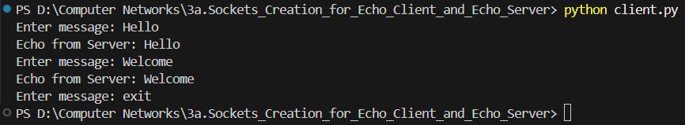
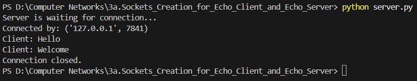

# 3a.CREATION FOR ECHO CLIENT AND ECHO SERVER USING TCP SOCKETS
# AIM
To write a python program for creating Echo Client and Echo Server using TCP
Sockets Links.
## ALGORITHM:
1. Import the necessary modules in python
2. Create a socket connection to using the socket module.
3. Send message to the client and receive the message from the client using the Socket module in
 server .
4. Send and receive the message using the send function in socket.
## PROGRAM:
server.py
```
import socket

# Create TCP socket
server = socket.socket(socket.AF_INET, socket.SOCK_STREAM)

# Bind IP address and port
server.bind(("localhost", 5000))

# Listen for client connection
server.listen(1)
print("Server is waiting for connection...")

# Accept client connection
conn, addr = server.accept()
print("Connected by:", addr)

while True:
    # Receive message from client
    data = conn.recv(1024).decode()

    if not data or data.lower() == "exit":
        print("Connection closed.")
        break

    print("Client:", data)

    # Echo the same message back to client
    conn.send(data.encode())

# Close connection
conn.close()
server.close()
```

client.py
```
import socket

# Create TCP socket
client = socket.socket(socket.AF_INET, socket.SOCK_STREAM)

# Connect to server
client.connect(("localhost", 5000))

while True:
    # Read message from user
    message = input("Enter message: ")

    # Send message to server
    client.send(message.encode())

    if message.lower() == "exit":
        break

    # Receive echoed message
    data = client.recv(1024).decode()
    print("Echo from Server:", data)

# Close socket
client.close()
```

## OUTPUT:
client.py
<br>

<br>
server.py
<br>


## RESULT
Thus, the python program for creating Echo Client and Echo Server using TCP Sockets Links 
was successfully created and executed.
